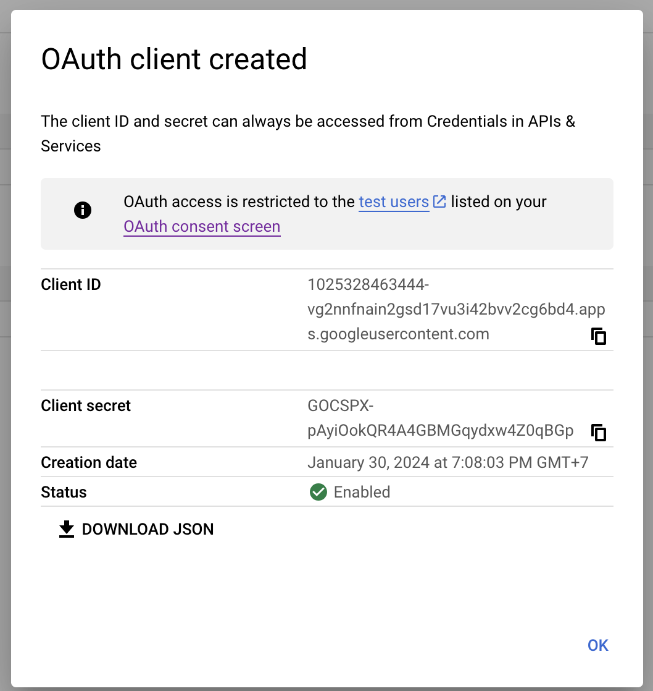

# Keycloak

## [Nhắc lại kiến thức](./Review_Knowledge.md)

## Giới thiệu

- Keycloak là một giải pháp mã nguồn mở cho việc quản lý authentication và authorization trong ứng dụng. Nó cho phép xây dựng các chức năng login, logut, quản lý và phân quyển user mà không phải cấu hình từ đầu.

- Keycloak có thể được sử dụng để triển khai application IAM (Identity and Access Management) trong môi trường microservices.

## Các thành phần chính

1. **Realm**: Quản lý user, roles, and groups

2. **Client**: Đại diện cho ứng dụng sẽ tương tác với keycloak để authentication và authorization

3. **User**: Là những user được xác thực, quản lý bởi keycloak

4. **Role**: Là những role được gán cho user

5. **Group**: Dùng để quản lý các nhóm người dùng

6. **Identity Provider(IDP)**: là hệ thống bên ngoài cung cấp dịch vụ authen người dùng (GG, Facebook, GitHub, ...)

## Các loại authen trong Keycloak

- Xác thực bằng password, Oauth2, OpenID Connect,...

## Demo

### Authen, author

1. [Sử dụng Client authentication và Authorization](./iam-service//)

2. [Sử dụng Srping Security](./book-service/)

### Quản lý user, role thông qua rest api

- **admin-cli** là một client mặc định trong Keycloak, được cấu hình để cho phép admin tương tác với Keycloak thông qua code mà không yêu cầu giao diện.

- Nếu không muốn dùng **admin-cli** thì phải cấp quyền **realm-admin** trong **realm-management** cho client và user để quản lý toàn bộ realm

  - Cấp quyền realm-admin cho client: **Chọn client -> Service accounts roles -> Assign role -> realm-admin**

  - Cấp quyền realm-admin cho user: **Chọn Users -> Role mapping -> Assign role -> realm-admin**

### SSO, Oauth2

- SSO: Single Sign-On, cho phép user login vào nhiều ứng dụng trong cùng hệ thống mà không cần login lại.

  - Cấu hình SSO: **Realm settings -> Clients -> Chọn client -> Settings -> Authentication flow-> Implicit flow**

  - **Lưu ý**: Khi bật **Implicit flow** chỉ hỗ trợ SSO cho các client trong cùng realm.

- Oauth2: là protocol được sử dụng để authorization, chia sẻ resource giữa các ứng dụng với nhau mà không cần chia sẻ thông tin username, password

  - Cấu hình Oauth2 trong **Identity providers**

  - **Google**

    - Trong **Keycloak** chọn tab **Identity Providers** -> **Google** -> Copy giá trị trong ô **Redirect URI**

    - Mở tab mới truy cập vào [console cloud google](https://console.cloud.google.com/)

    - Chọn **APIs & Services** -> **Identifiants** -> **Create Credentials** -> **OAuth client ID** -> **Configure consent screen**

    - Để tạo **OAuth consent screen** làm theo các bước sau: Trong **User Type** ->  **External** -> **Create** -> **Application name** -> **Save x 3 lần**

    - Click tab **Credentials** -> **Create Credentials** -> **OAuth client ID** -> **Web application** -> **Name** -> Paste giá trị đã Copy trong ô **Redirect URI** của **Keycloak** vào **Authorized redirect URIs** -> **Create**

    - Sau khi **create** sẽ có **Client ID** và **Client secret**
        

    - Quay về tab **Keycloak** và paste vào ô tương ứng -> **Save**

  - **Github**

    - Tương tự với [**Login with Github**](https://github.com/settings/developers) -> **New Auth App** -> **Save**

### [Thêm user attributes vào JWT](#custom-jwt)

- **Client scopes -> Profile -> Mappers -> By configuration -> User Attribute**

### Thêm role vào Default roles

- **Realm settings -> User registration -> Default roles**

### [Custom theme](#custom-theme-trong-keycloak)

- Có 2 cách để custom theme trong keycloak:

  1. Tạo file ftl, css, js

      - Mỗi theme sẽ có cấu trúc như sau:

        - File theme.properties để cấu hình theme

          - parent: theme gốc mà bạn muốn kế thừa
          - import: thư mục của theme gốc
          - styles: đường dẫn đến file css
          - scripts: đường dẫn đến file js

        - Folder resources chứa các file css, js, image, ...

        - Folder messages: chứa các file i18n

  2. Dùng thư viện [Keycloakify](https://www.keycloakify.dev/) bằng cách sử dụng React

## Tham khảo

### Keycloak document

- [Authorization Services Guide by Keycloak](https://www.keycloak.org/docs/latest/authorization_services/index.html)

- [Keycloak Admin REST API](https://www.keycloak.org/docs-api/latest/rest-api/index.html)

- [Policy enforcers](https://www.keycloak.org/docs/latest/authorization_services/#_service_overview)

- [Themes](https://www.keycloak.org/docs/latest/server_development/#_themes) - [Themes Default](https://github.com/keycloak/keycloak/tree/main/themes/src/main/resources-community/theme/base)

- [Keycloak Quickstart](https://github.com/keycloak/keycloak-quickstarts/tree/latest/spring/rest-authz-resource-server)

### Series học Keycloak

- [Dive Into Development](https://www.youtube.com/playlist?list=PLHXvj3cRjbzs8TaT-RX1qJYYK2MjRro-P)

- [Series Keycloak Baeldung](https://www.baeldung.com/tag/keycloak) - [GitHub](https://github.com/eugenp/tutorials/tree/master/spring-boot-modules/spring-boot-keycloak)

- [Tích hợp keycloak với Spring Security 6](https://github.com/kale1st/Keycloak_Spring_Boot_Application/tree/master)

### Custom theme trong Keycloak

- [Dockerize Keycloak 21 with a custom theme](https://saurav-samantray.medium.com/dockerize-keycloak-21-with-a-custom-theme-b6f2acad03d5) - [GitHub](https://github.dev/saurav-samantray/custom-auth-service)

- [Customize Keycloak appearance with themes](https://nagasudhir.blogspot.com/2024/04/customize-keycloak-appearance-with.html)

### Custom JWT

- [Thêm user attributes vào JWT](https://medium.com/@lakshminp/adding-user-attributes-to-jwt-token-in-keycloak-f3981b7df310)

### Import Realm trong docker compose

- [Import Realm trong docker compose](https://www.youtube.com/watch?v=1u8GlfKyB_Q)
