# Sử dụng phân quyền trong file policy.json

- Bât cấu hình **Authorization** trong **Capability config** sẽ xuất hiện tab mới **Authorization**, sau đó cấu hình các **Resource, Policies, Permissions** và kiểm tra lại ở tab **Evaluate**

## Mô tả

- Phân quyền trực tiếp trên keycloak

- Quản lý user, role trong keycloak thông qua rest api

## Hướng dẫn

## Cấu hình

- Chạy file `docker-compose.yml` để tự động import realm và các config vào Keycloak.

- Truy cập `http://localhost:8181/` chọn realm `Seminar`

    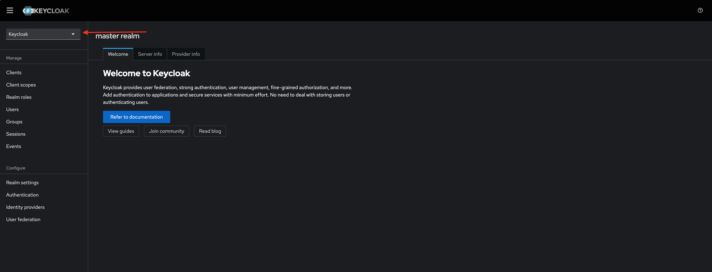

- Cấu hình **Resource, Policies, Permissions**

    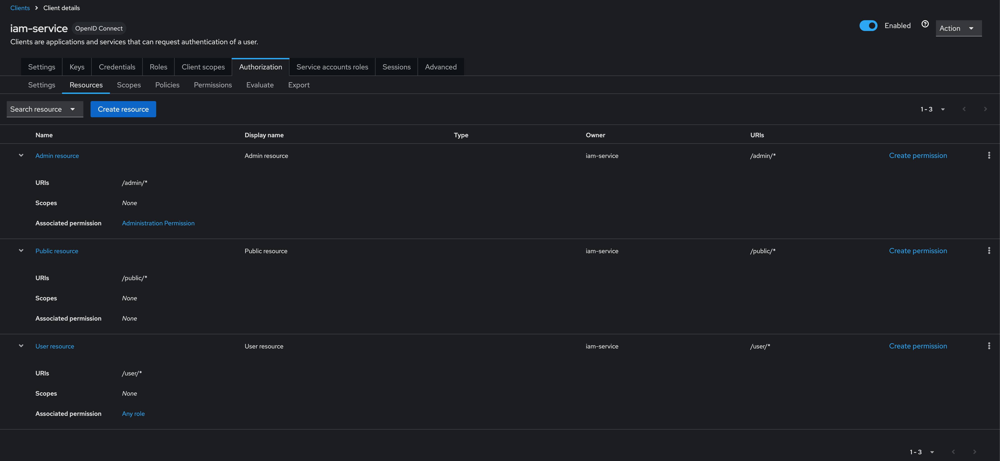

    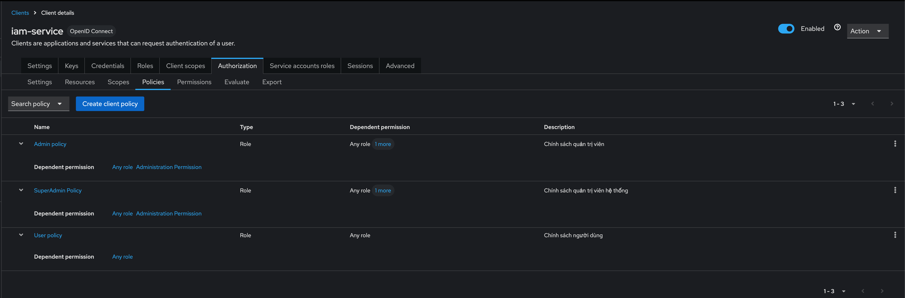

    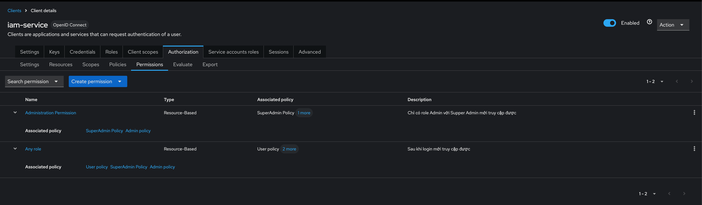

- Tạo user, phân quyền

    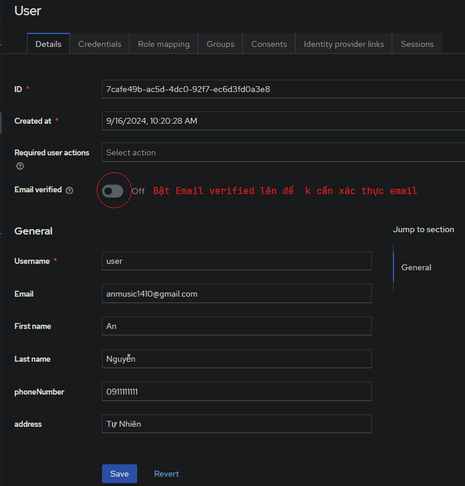

    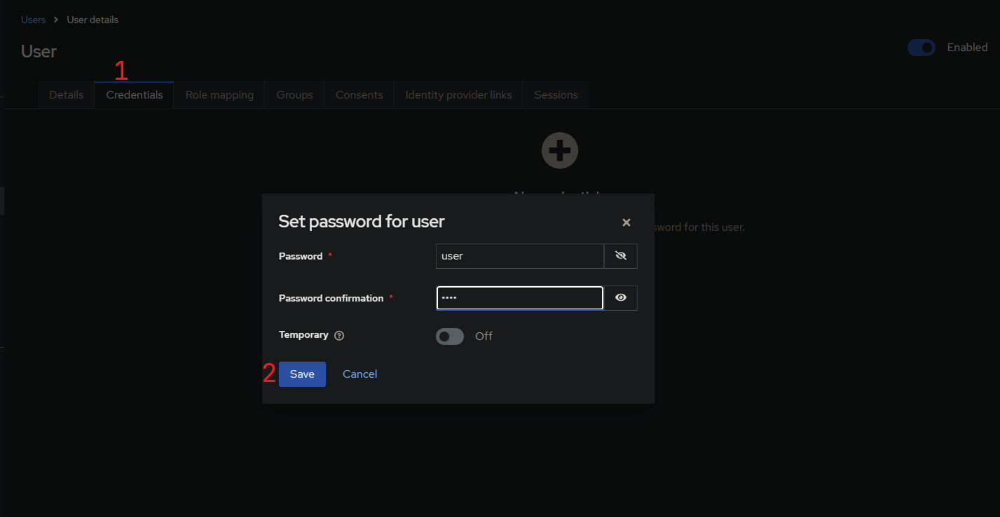

    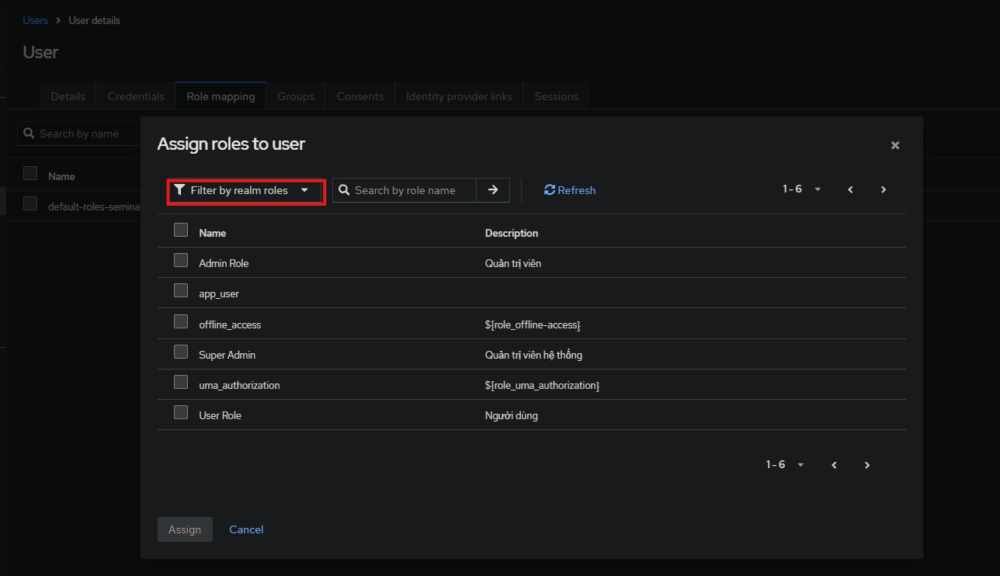

    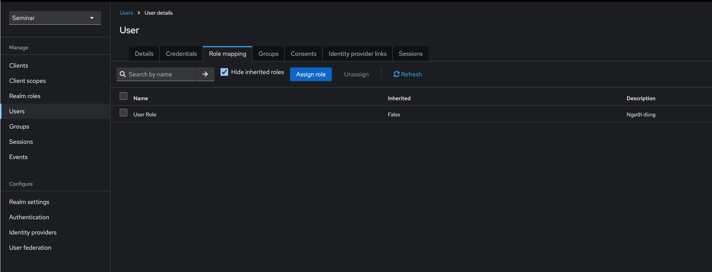

- **Evaluate**

  - Thử **User:** `user` với **Role:** `User Role`, ta thấy với **User resource** `user` có quyền truy cập được, còn **Admin resource** thì không

    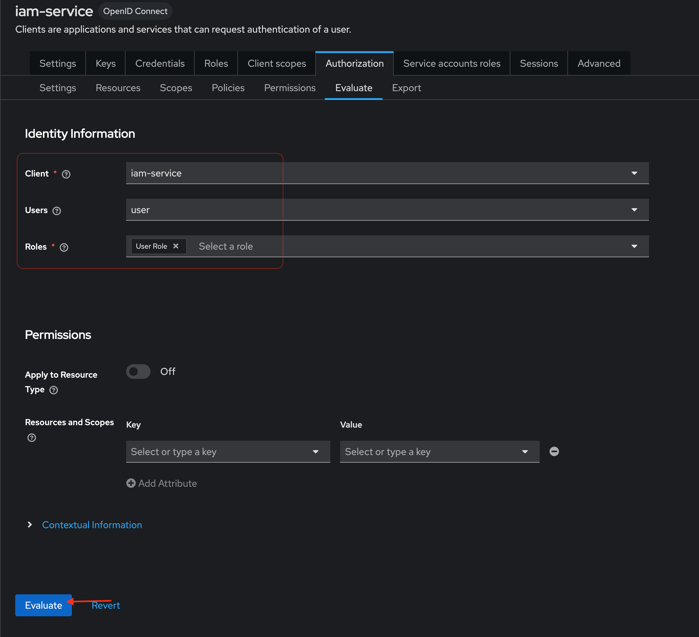

    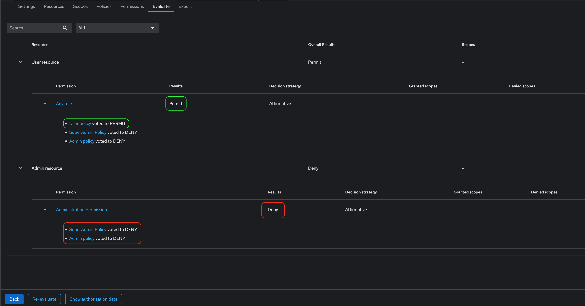

- Cấu hình api gửi email, điền lại username, password

    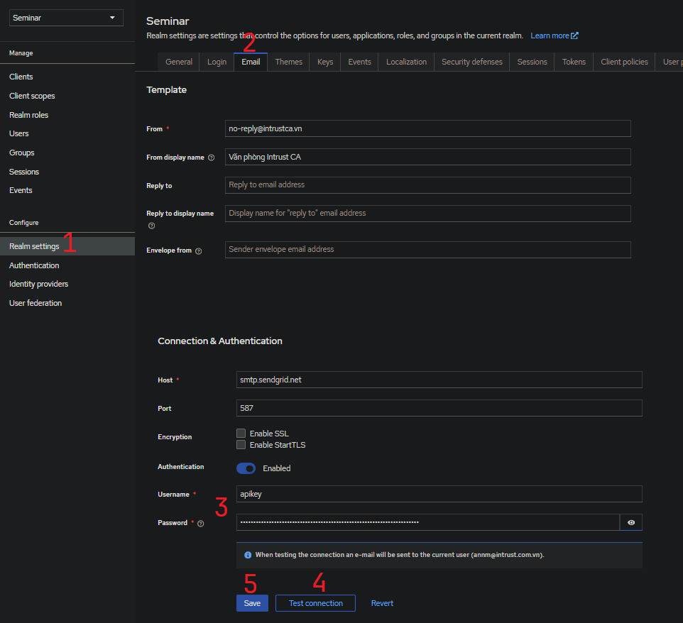

## Chạy project

- **Regerate** lại **Clinet Secret** của 2 clients `book-service` và `iam-service`

    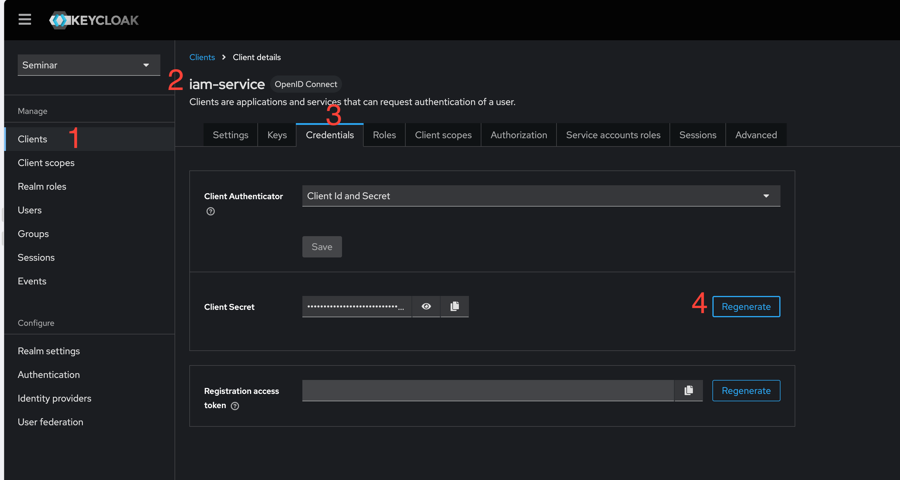

- Sau đó **replace** lại các **client secret** trong file `application.properties` và `policy-enforcer.json` và chạy project

    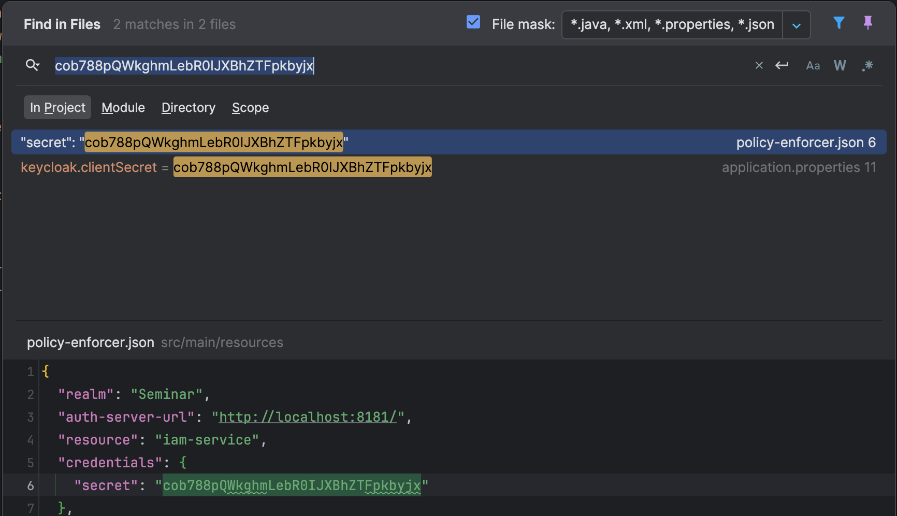

- Truy cập `http://localhost:8080/swagger-ui/index.html#` để truy cập vào ứng dụng

    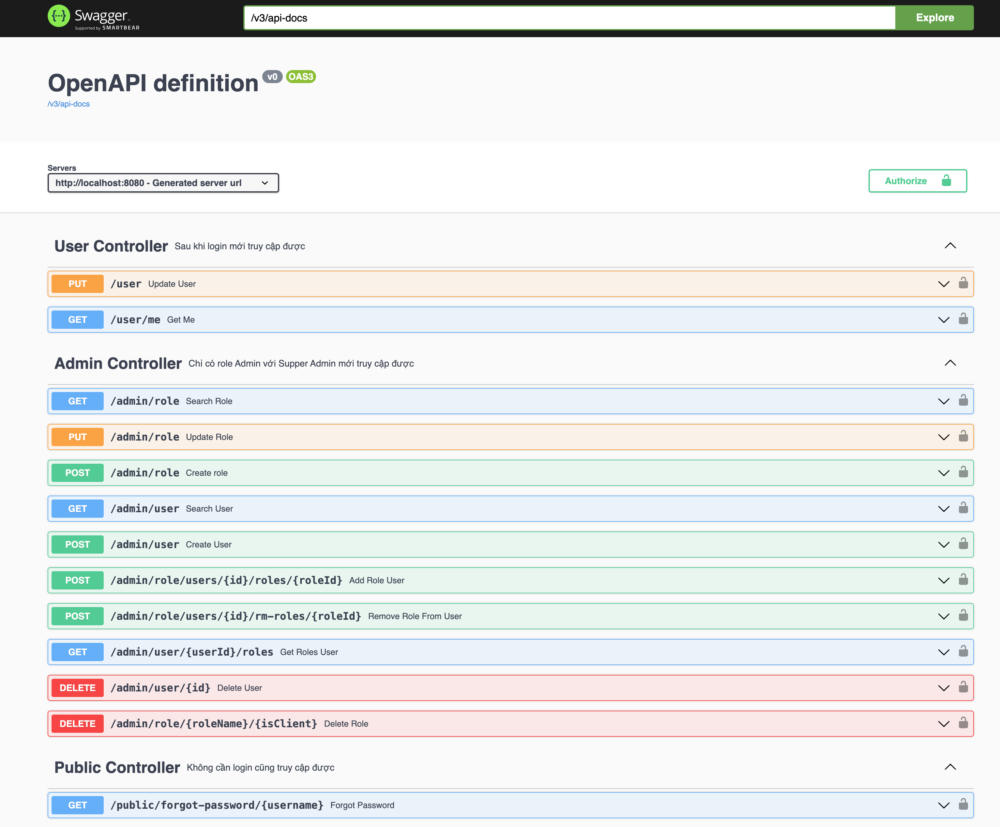
